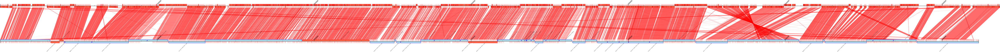

# getaddons
Get extra regions in contigs assembly

Example of which addons we want to get: 

1. Denovo assembly, get contigs >1000nt
2. Use contiguator with the closest reference genome : http://combo.dbe.unifi.it/contiguator 
3. Download the complete contiguator results folder
4. Inside Map_ folder find the files : UnAlignedContigsHits.fsa and UnAlignedContigsDetails.tab
5. Get addond bigger tha 10,000 nt (perl removesmalls.pl 10000 UnAlignedContidsHits.fsa > more10000_UnAlidnedContidsHits.fsa
6. Annotate big addons on PATRIC : https://www.patricbrc.org/
7. From PATRIC, download the tab delimited annotations file : Achromobacter_CF116addons.tab
8. Get phagelike table (bash addons-getphagetable.sh Achromobacter_CF116addons.tab UnAlignedContigsDetails.tab), the output is: megatable.tab 

done

